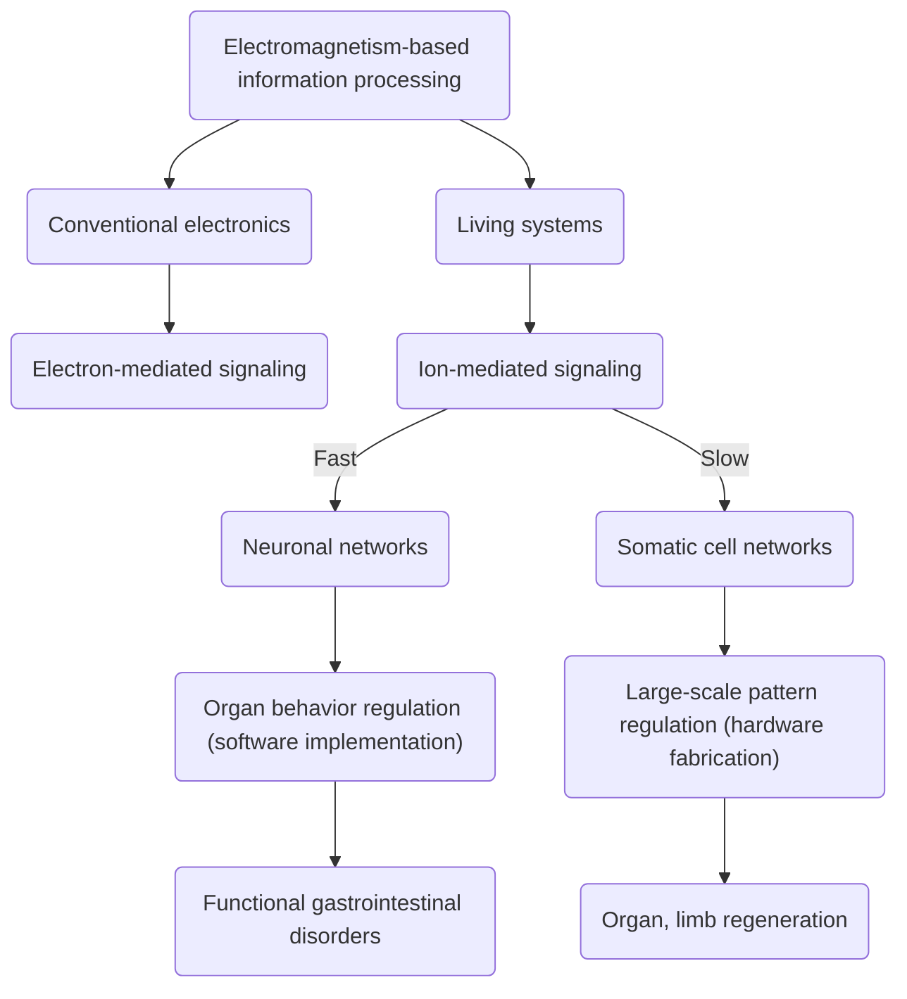

# [Francisco Morales](https://github.com/fm9030133)
I am a student biophysicist intending to bring emerging biotechnologies to market. My specific interest is in modeling the information processing that occurs in living systems. This site documents both my project-based journey in developing such an expertise and my innovation brainstorming process. I welcome inquiries for work and collaboration at **fm9030133@gmail.com**

# [Inspiration: Leaders and Ventures](people.md)
Although I am grateful to the countless contributors to this field there are a handful of individuals whos work I follow closely. Similarly, there are a few startups that I am particularly interested in. Such focus allows me to deepen my expertise. 

# Diverse Interests, Unifying Skillset
*Electricity: The Fundamental Force of Communication.*  
Of the four fundamental physical forces electromagnetism is the most tractable for information processing across diverse systems. This common modality allows as a bridge between conventional electronics and biological systems, enabling increasingly effective medical intervention. I believe specializing in this underlying control layer makes me a valuable team member in biomedical ventures.(*citations/references pending*)  

# [Developing My Expertise in Bioelectricity](reading.md)
Living tissue realiably self-assemble into complex structures. Key goal-states of this massively parallel behavior are encoded by intercellular communication as patterned gradients of charge carriers. Growing understanding of this phenomenon is yielding an emerging layer of control to guide large-scale development of animals. (*citations/references pending*)  
<!--- Include Levin references -->
  
I'm developing my expertise in this domain by reading and discussing academic publications and experimenting with relevant computational simulations. I'm learning to use BETSE (BioElectric Tissue Simulation Engine), a Python-based ["simulator for 2D computational multiphysics problems in the life sciences – including electrodiffusion, electro-osmosis, galvanotaxis, voltage-gated ion channels, gene regulatory networks, and biochemical reaction networks \(e.g., metabolism\)."](https://github.com/betsee/betse)  

# [Data Visualization Portfolio](dataviz.md)
Along with subject matter knowledge I am also refining my key upstream skills of planning and communication of complex situations. I create insightful, vizually appealing process maps and scientific illustrations. [Click here to see my growing portfolio.](dataviz.md)

# Tentative Ideas  

## Upstream Medical Interventions for Functional GastroIntestinal Disorders (FGIDs)
One way I hope to apply my biophysics skills is in developing treatments for functional gastrointestinal disorders (FGIDs). My life partner's chronic irritable bowel syndrome (IBS) has introduced me to this debilitating and mysterious family of illnesses. Emerging from research on biological information processing are methodologies for top-down control of organ system behavior.  
"‘Functional disorder’ is an umbrella term for a group of recognisable medical conditions which are due to *changes to the functioning of the systems* of the body *rather than due to a disease affecting the structure of the body*." A tentative implication of this definition is that FGIDs may be effectively treated by understanding the way control systems such as the enteric nervous system (ENS) orchestrate organ behavior at the level of bioelectronic information. Interventions can then be developed that treat functional disorders at the source via intelligent modifications of endogenous electric gradients, thus increasing effectiveness and minimizing side effects.
(*citations/references pending*) 

