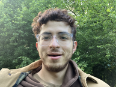
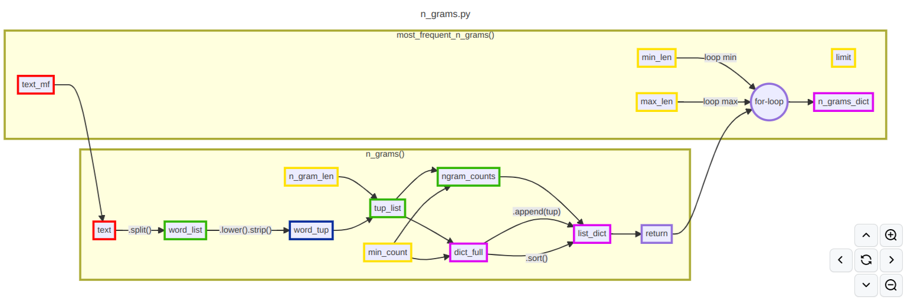
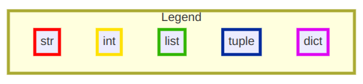

# Translative Biotechnology
I am a student biophysicist intending to bring emerging technologies to market. My specific interest is in modeling the flow of information in living tissue. This repository documents my project-based journey in developing such an expertise. I welcome inquiries for work and collaboration.  

*Francisco Morales*
  
# Bioelectricity
Living tissue realiably self-assemble into complex structures. Key goal-states of this massively parallel behavior are encoded by intercellular communication as patterned gradients of charge carriers. Growing understanding of this phenomenon is yielding an emerging layer of control to guide large-scale development of animals.  
I'm developing my expertise in this domain by reading and discussing academic publications and experimenting with relevant computational simulations. I'm learning to use BETSE (BioElectric Tissue Simulation Engine), a Python-based ["simulator for 2D computational multiphysics problems in the life sciences – including electrodiffusion, electro-osmosis, galvanotaxis, voltage-gated ion channels, gene regulatory networks, and biochemical reaction networks \(e.g., metabolism\)."](https://github.com/betsee/betse)  
  
# Process Visualization
Along with subject matter knowledge I am also refining key upstream skills such as planning and communication of complex processes. I use ["Mermaid, the JavaScript based diagramming and charting tool"](https://mermaid.js.org/) to create insightful process maps for projects. Below is the [process map for a recent college programming assignment.](flow.md)  
   

# Inspiration: Leaders and Ventures
Although I am grateful to the countless contributors to this field there are a handful of individuals whos work I follow closely. Similarly, there are a few startups that I am particularly interested in. Such focus allows for deeper expertise.  
