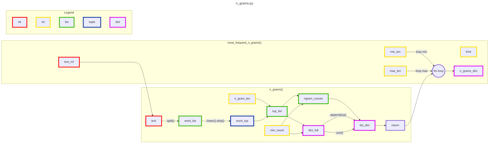

I use tools such as [Mermaid.js](https://mermaid.js.org/), [Lucidchart](https://www.lucidchart.com/), and [Biorender](https://www.biorender.com/) to create insightful, vizually appealing process maps and scientific illustrations.

-----------
[College Python programming assignment, flowchart, Mermaid.js](flow.md)    

