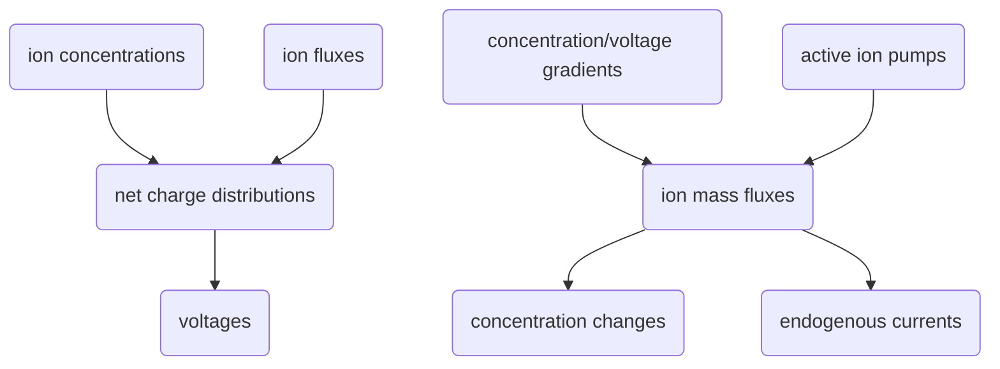

# ["Exploring Instructive Physiological Signaling with the Bioelectric Tissue Simulation Engine (2016)"](http://www.frontiersin.org/Journal/10.3389/fbioe.2016.00055)
*Unless otherwise stated, all quotes and discussions on this page reference the above linked publication.*  
My goal(s) in this discussion are to:
- Improve my understanding of BETSE and bioelectric control in general.
----------
- Bioelectric cell properties are powerful targets for modulating:
    - Stem cell function
    - Regeneratie response
    - Developemental patterning
    - Tumor reprograming

- Properties such as distributions of:
    - Resting potentials
    - Ion flows
    - Electric fields

- "Explaining and learning to control large-scale pattern is a central unsolved problem"
- "dynamics of signals orchestrating large-scale order *in vivo*"
- "ednogenous bioelectric gradients across tissues can be a very early pre-pattern for susequent transcriptional and morphogenetic events."
- "imperative to understand not only how ion channel and pump activity controls single-cell electrical properties but also how electrical gradients self-organize, propagate, and evolve in multicellular networks."

- "ephaptic coupling created by local field potentials"
- "Even briefly altering the bioelectric connectivity of a cellular network enable rewriting of an organism's target morphology."
- "trans-epithelial potential (TEP)... forms at the outer boundary of an organ or organism."
- "The TEP is created when multicellular structures develop impermeable tight junctions (TJ) between cells at the exterior boundary"
- "Understanding plasma membrane voltage gradients and transepithelial potentials, and their spatiotemporal transitions *in vivo* is a key enabling step"
- "biorealistic perspective of ion concentrations and movements, rather than an equivalent electric circuit model"
- "realistic modeling system for bioelectricity will enable":
    1. formulation of models of specific patterning events based on realistic physiological and channel expression data
    2. design of predicted intervention strategies for inducing desired changes in electrical state and downstream patterning outcomes
    3. investigation of the broader capabilities of non-neural bioelectrical networks for use in synthetic biology and unconventional computation architectures

- "BETSE integrate a diverse range of mechanisms...":
    - "electrodiffusion of multiple ions under chemical and electrical gradients in various contexts"
    - "consideration of concentration, charge, voltage, and current in both -intra and extracellular networks in order to capture important signals, such as tissue-wide edogenous ion currents, TEP, and local field potentials"
    - "dynamic control of membrane permeability and gap junction state to simulate voltage and ligand-gated channels"
- "voltages (electric potential energies) are created by net electrical charge"
- "ions are the fundamental units of the bioelectrical system, and their concentrations, mass fluxes, and transport mechanisms are ultimately important.":
    - "ions... can develop concentration profiles generating net charge in a region of space", creating a voltage.
    - "mass flux of ions can generate net current,... associated with intracellular and tissue-wide electric fields."
- BETSE considers ions relevant to most living systems: Na+, K+, Cl-, Ca2+, HCO3-, H+, charged macromolecules iex proteins (X-).
- BETSE considers movement of charged biomolecule such as:
    - voltage reporter dye
    - glutamate
    - serotonin
    - inositol triphosphate (Yn- or Yn+, n = variable charge number)
- "At it's core, BETSE keeps track of":
    - ion concentrations and ion fluxes in space and time,
    - reducing them to net charge distributions inside and outside of the cell,
    - using these net charges to calculate voltages inside and outside the cellular space,
    - calculating changes to concentrations resulting from ion mass fluxes resulting from concentration/voltage gradients and by active ion pumps,
    - and calculating endogenous currents from the net mass flux of ions

- "Membrane permeability to specific ions is used as a dynamic variable to simulate the action of specific ion channels"
- BETSE handles:
    - electro-diffusive transport
    - voltage calculations
    - ion pumps
    - ion channel dynamics
    - voltage-sensitive GJ
    - electroosmotic flows

- "BETSE is... uniquely specialized to work with a range of bioelectric phenomena arising in biological tissues"
- BETSE uses:
    - Numpy
    - Scipy
    - Matplotlib
- "uses matrix-based differential equation solvers"
- Current simulation limit is one square millimeter of tissue (~10,000 cells)
